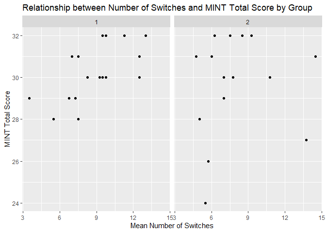

Latham Portfolio 6
================
Lauren
4/18/2021

The purpose of this portfolio piece is to combine some of the verbal
fluency variables I have scored for to collapse across tasks, and look
at the relationship between these variables and a couple of cognitive
tasks to see if these aspects of verbal fluency performance reflect the
hypothesized cognitive processes.

``` r
library(tidyverse)
```

    ## -- Attaching packages --------------------------------------- tidyverse 1.3.0 --

    ## v ggplot2 3.3.3     v purrr   0.3.4
    ## v tibble  3.0.5     v dplyr   1.0.3
    ## v tidyr   1.1.2     v stringr 1.4.0
    ## v readr   1.4.0     v forcats 0.5.1

    ## -- Conflicts ------------------------------------------ tidyverse_conflicts() --
    ## x dplyr::filter() masks stats::filter()
    ## x dplyr::lag()    masks stats::lag()

``` r
data <- read.csv("Data.csv")
```

I currently only have complete data for 33 participants so I’m starting
off by filtering the dataset to only include participants w/ complete
data.

``` r
data <- data %>% 
  filter(Phon.Switch > 0)
data
```

    ##    ï..PID_long PID_short Group Spec.Dx VF.Total.Animals VF.Total.Vegetables
    ## 1  3AAFA004749      AAFA     1       0               21                   8
    ## 2  3AGSE005046      AGSE     1       0               26                  17
    ## 3  3BMDI004328      BMDI     1       0               14                   8
    ## 4  3BTFU004494      BTFU     1       0               20                  14
    ## 5  3BXPU001647      BXPU     1       0               14                  15
    ## 6  3CALE004782      CALE     1       0               18                  11
    ## 7  3CLMA004064      CLMA     1       0               18                  11
    ## 8  3CSSM005399      CSSM     1       0               18                  13
    ## 9  3CTLO000231      CTLO     1       0                9                   6
    ## 10 3DELE001896      DELE     1       0               23                  15
    ## 11 3DMSA007395      DMSA     1       0               16                  18
    ## 12 3DPPA005310      DPPA     1       0               22                  12
    ## 13 3DRMO004762      DRMO     1       0               16                  10
    ## 14 3DRST005261      DRST     1       0               21                  15
    ## 15 3DWWI003812      DWWI     1       0               23                  18
    ## 16 3EKMI005072      EKMI     1       0               22                  12
    ## 17 3GMLA004341      GMLA     1       0               26                  13
    ## 18 3ARCO003796      ARCO     2       1               30                  18
    ## 19 3AWCO000820      AWCO     2       2               19                  10
    ## 20 3BMCO002773      BMCO     2       1               18                  14
    ## 21 3CMAN004068      CMAN     2       2               10                   5
    ## 22 3CMGR004003      CMGR     2       2               16                  12
    ## 23 3DNCO001779      DNCO     2       2               10                  12
    ## 24 3DSCH000809      DSCH     2       2               17                   9
    ## 25 3EKWI002921      EKWI     2       1               22                  12
    ## 26 3ELCR002521      ELCR     2       2               12                  16
    ## 27 3FXSA003091      FXSA     2       2               17                  10
    ## 28 3HRCO003512      HRCO     2       2               17                  14
    ## 29 3JDRA002244      JDRA     2       2               22                   8
    ## 30 3JFHO003258      JFHO     2       2               25                  19
    ## 31 3JFST004299      JFST     2       2               15                   8
    ## 32 3JPLO002067      JPLO     2       1               17                  11
    ## 33 3JSMA003088      JSMA     2       1               14                  13
    ##    VF.Total.F VF.Total.L VF.Freq.Median.Animals VF.Freq.Mean.Animals
    ## 1          12         10                 2.6484               2.5012
    ## 2          16         17                 2.1013               2.2585
    ## 3           9         12                 2.7642               2.6492
    ## 4          12         12                 2.4239               2.4497
    ## 5          11         11                 2.9894               3.1769
    ## 6           9         12                 2.3579               2.3844
    ## 7           8          7                 2.7573               2.6983
    ## 8          19         20                 2.5677               2.5861
    ## 9           6          4                 2.4099               2.6596
    ## 10         16         14                 2.4525               2.5650
    ## 11         14         15                 3.0431               3.0209
    ## 12         17         18                 2.8101               2.7537
    ## 13         10          5                 3.0024               2.8451
    ## 14          9         10                 3.0290               2.8924
    ## 15         13         14                 2.7642               2.6410
    ## 16         16         14                 2.8653               2.7107
    ## 17         15         18                 2.5333               2.5868
    ## 18         21         19                 2.5799               2.4961
    ## 19          6          9                 2.9894               2.8969
    ## 20         16         18                 2.8539               2.8003
    ## 21         10          5                 3.2213               3.1525
    ## 22          5          4                 3.1738               3.0146
    ## 23          7          7                 3.0431               2.9865
    ## 24          9          7                 2.8943               2.8095
    ## 25         21         18                 2.8017               2.8391
    ## 26          5          4                 3.1738               2.9135
    ## 27         14          8                 2.6937               2.4941
    ## 28         11          6                 2.8292               2.7274
    ## 29          8          6                 2.5921               2.5614
    ## 30         15         15                 2.0719               2.2834
    ## 31         17         14                 2.8363               2.7871
    ## 32         14         13                 2.8136               2.7620
    ## 33         12         17                 3.0358               3.0403
    ##    VF.Freq.SDEV.Animals VF.Freq.Median.Veg VF.Freq.Mean.Veg VF.Freq.SDEV.Veg
    ## 1                0.7070             2.4082           2.0325           0.8762
    ## 2                0.7418             2.3365           2.2184           0.6972
    ## 3                0.7951             2.3634           2.2773           0.6154
    ## 4                0.9131             2.0927           2.0074           0.6344
    ## 5                0.5020             2.3365           2.2554           0.5169
    ## 6                0.8987             2.2405           2.1731           0.4381
    ## 7                0.6760             2.0682           1.9761           0.4666
    ## 8                0.7003             2.2405           2.1922           0.4895
    ## 9                0.8453             2.2664           2.1262           0.5973
    ## 10               0.8317             2.0682           1.6870           0.7650
    ## 11               0.5055             2.3144           2.2628           0.5335
    ## 12               0.7457             2.2664           2.2727           0.3384
    ## 13               0.7138             2.3861           2.3586           0.5462
    ## 14               0.6343             2.2405           2.1335           0.5739
    ## 15               0.7353             2.2664           2.1725           0.5870
    ## 16               0.8915             2.2664           2.0569           0.7325
    ## 17               0.7145             2.0414           1.9508           0.6101
    ## 18               0.8004             2.2664           2.2078           0.4819
    ## 19               0.5990             4.0980           6.1412           4.7682
    ## 20               0.7056             2.1207           2.0972           0.5389
    ## 21               0.5628             1.7243           1.7685           0.3459
    ## 22               0.6525             2.3144           2.2380           0.5539
    ## 23               0.7141             2.2069           2.2013           0.3291
    ## 24               0.6961             2.2923           2.0828           0.7406
    ## 25               0.5349             2.4082           2.3239           0.4541
    ## 26               0.7884             2.4800           2.4708           0.3639
    ## 27               0.5733             2.1207           1.9093           0.7352
    ## 28               0.7431             2.2885           2.1934           0.5610
    ## 29               0.8329             2.7612           2.6116           0.3915
    ## 30               0.7868             2.2405           2.0613           0.5980
    ## 31               0.6637             2.3634           2.3355           0.4106
    ## 32               0.7520             2.4283           2.5270           0.2822
    ## 33               0.5433             2.2923           2.1779           0.4741
    ##    VF.Freq.Median.F VF.Freq.Mean.F VF.Freq.SDEV.F VF.Freq.Median.L
    ## 1            3.3415         3.3754         0.5267           3.2595
    ## 2            3.1708         2.9439         0.9842           2.8182
    ## 3            3.4818         3.4012         0.7214           3.6247
    ## 4            2.6241         2.7514         1.0663           2.6482
    ## 5            2.9841         2.9079         0.8959           2.5328
    ## 6            3.4414         3.1199         1.1308           2.9561
    ## 7            3.3516         3.3385         0.3502           2.9571
    ## 8            3.4819         3.2236         0.8692           3.0195
    ## 9            3.5486         3.4574         0.7117           3.1339
    ## 10           3.4138         3.2782         0.9018           2.9119
    ## 11           2.9523         2.9240         1.3802           3.3276
    ## 12           3.2499         3.0611         0.9871           3.3926
    ## 13           3.6001         3.4698         0.8478           3.6527
    ## 14           2.6758         2.9357         1.3434           3.5434
    ## 15           3.5931         3.3249         0.8370           2.3978
    ## 16           2.4212         2.7109         1.1216           2.9732
    ## 17           2.2405         2.7202         1.1681           2.5173
    ## 18           2.9335         2.8276         1.1117           2.8228
    ## 19           3.8034         3.6638         0.5495           3.5061
    ## 20           3.0561         3.0837         1.1340           3.3565
    ## 21           3.4498         3.2753         0.7512           4.7548
    ## 22           3.5540         3.6708         0.6127           4.4501
    ## 23           3.0449         3.1443         0.7670           2.2504
    ## 24           3.2813         3.8723         1.0549           2.8943
    ## 25           3.2076         3.1600         0.8765           2.8228
    ## 26           2.5478         2.5963         0.7542           3.3167
    ## 27           3.1376         3.1780         0.7742           2.8875
    ## 28           3.7252         3.3995         0.8863           3.5699
    ## 29           2.6965         2.5807         0.8099           3.6694
    ## 30           2.8627         2.8940         1.0281           3.2605
    ## 31           3.1493         2.9004         0.9919           3.1788
    ## 32           3.1141         3.0776         0.8168           2.5391
    ## 33           3.3021         3.4349         0.8578           3.7252
    ##    VF.Freq.Mean.L VF.Freq.SDEV.L VF.Cluster.Animals VF.Switch.Animals
    ## 1          3.2909         1.1580               0.57                13
    ## 2          3.1552         1.0417               1.36                10
    ## 3          3.3061         1.5814               0.88                 7
    ## 4          2.7818         1.3321               0.54                12
    ## 5          2.5830         1.0345               0.44                 8
    ## 6          3.3438         1.1433               0.58                11
    ## 7          3.2167         0.8375               1.57                 6
    ## 8          3.0384         1.0951               1.57                 6
    ## 9          3.1363         1.1761               0.80                 4
    ## 10         3.0663         0.7706               1.30                 9
    ## 11         3.4530         1.1317               0.46                10
    ## 12         3.1310         1.3951               1.88                 7
    ## 13         3.8906         0.5609               1.13                 7
    ## 14         3.5217         1.0293               1.20                 9
    ## 15         2.6590         1.2522               1.18                10
    ## 16         2.8988         1.0828               0.64                13
    ## 17         2.4319         1.0086               0.88                15
    ## 18         2.8943         1.2125               0.83                17
    ## 19         3.3633         1.1310               1.00                 9
    ## 20         3.1594         0.9428               0.69                12
    ## 21         4.3472         1.1403               0.43                 6
    ## 22         4.3062         0.7443               1.13                 7
    ## 23         2.8469         1.7779               1.00                 5
    ## 24         2.7293         0.8896               2.00                 5
    ## 25         3.1716         0.9553               0.71                13
    ## 26         3.0530         0.9833               1.00                 4
    ## 27         2.9597         1.0228               1.43                 6
    ## 28         3.7472         0.7666               1.86                 6
    ## 29         3.5605         1.5489               1.88                 7
    ## 30         3.0479         1.1480               3.29                 6
    ## 31         3.3766         0.9454               1.83                 5
    ## 32         2.5622         0.8342               1.43                 6
    ## 33         3.5189         0.8845               1.33                 5
    ##    VF.Cluster.F VF.Switch.F VF.Cluster.L VF.Switch.L MOCA.REG MOCA.DEL.FREE
    ## 1          0.07          13         0.50          13        9             1
    ## 2          0.42          11         1.50           7       10             5
    ## 3          0.13           7         0.71           6       10             1
    ## 4          0.20           9         1.60           4       10             5
    ## 5          0.00          10         0.63           7        9             3
    ## 6          1.75           3         2.00           3       10             4
    ## 7          0.60           4         0.00           6       10             2
    ## 8          0.19          15         0.67          11       10             3
    ## 9          0.33           5         2.00           1        9             4
    ## 10         0.07          14         0.14          13       10             4
    ## 11         0.40           9         0.64          10        9             4
    ## 12         1.13           7         1.00           9       10             1
    ## 13         0.43           6         0.25           9        9             5
    ## 14         0.29           6         0.43           6        9             5
    ## 15         0.88           7         0.15          12       10             5
    ## 16         0.21          13         0.25          11        9             1
    ## 17         0.25          11         0.90           9        8             2
    ## 18         0.53          14         1.00          10        9             0
    ## 19         0.50           3         0.38           7       10             0
    ## 20         0.73          10         0.80           9       10             2
    ## 21         0.22           8         0.67           2        9             0
    ## 22         0.17           5         3.00           0       10             0
    ## 23         0.00           6         0.75           3       10             2
    ## 24         1.33           2         0.22           8       10             0
    ## 25         0.21          18         0.50          11        8             0
    ## 26         0.00           9         0.00           6        6             0
    ## 27         0.07          13         0.00          12        9             1
    ## 28         0.27          10         0.75           3        8             3
    ## 29         0.29           6         0.20           4       10             3
    ## 30         0.15          12         0.36          10       10             3
    ## 31         0.29          13         0.56           8       10             4
    ## 32         0.40           9         0.88           7       10             3
    ## 33         0.44           8         0.38          12       10             0
    ##    MOCA.DEL.CUE MOCA.DEL.REC MOCA.TOTAL CRAFT.IMM.VERB CRAFT.IMM.PAR
    ## 1             2            1         24             13            12
    ## 2            NA           NA         28             22            17
    ## 3             3            1         22             19            14
    ## 4            NA           NA         28             32            19
    ## 5             1            1         22             23            19
    ## 6             1           NA         28             32            20
    ## 7             1            2         22             25            15
    ## 8             0            2         27             24            17
    ## 9             1           NA         23             20            15
    ## 10            0            1         29             27            20
    ## 11            1           NA         27             24            16
    ## 12            2            2         26             19            12
    ## 13           NA           NA         26             21            16
    ## 14           NA           NA         28             14            10
    ## 15           NA           NA         27             23            15
    ## 16            2            2         24             20            14
    ## 17            0            3         26             16            13
    ## 18            1            3         22             22            14
    ## 19            0            3         18             19            14
    ## 20            2            1         19             20            17
    ## 21            0            4         14             19             9
    ## 22            1            2         19             28            18
    ## 23            0            3         26             23            15
    ## 24            0            4         20             15            14
    ## 25            2            2         22             10             8
    ## 26            1            2         NA              9             7
    ## 27            3            1         25             20            14
    ## 28            0            1         23             18            15
    ## 29            1            1         25             26            17
    ## 30            2           NA         26             17            13
    ## 31            0            1         26              8             6
    ## 32            0            2         24             13            10
    ## 33            0            2         21             19            10
    ##    DIGIT.FOR.TOT DIGIT.FOR.LONG DIGIT.BACK.TOT DIGIT.BACK.LONG TRAILS.A.TIME
    ## 1              7              6              6               5            35
    ## 2              4              4              7               5            22
    ## 3              6              5              4               4            42
    ## 4              6              6              8               5            28
    ## 5              5              5              7               5            36
    ## 6             10              8              8               5            37
    ## 7              7              6              5               4            37
    ## 8             11              8              9               6            31
    ## 9              4              4              4               3            45
    ## 10            12              8              8               6            32
    ## 11             8              6              5               4            31
    ## 12            10              8              8               6            40
    ## 13             7              6              6               5            35
    ## 14            10              8              7               5            26
    ## 15             7              6              7               5            23
    ## 16             5              5              5               4            37
    ## 17            10              8              8               5            24
    ## 18             6              5              4               3            35
    ## 19             9              7              5               4            52
    ## 20             5              5              4               3            44
    ## 21             7              6              4               4            66
    ## 22             6              5              6               5            35
    ## 23             8              8              6               6            26
    ## 24             7              6              3               3            37
    ## 25            11              8              7               5            24
    ## 26             7              6              4               3            54
    ## 27             7              7              6               4            44
    ## 28             7              6              4               3            40
    ## 29             7              6              7               5            49
    ## 30             9              7              6               4            27
    ## 31             8              7              5               5            36
    ## 32             7              7              7               5            66
    ## 33             7              6              6               5            41
    ##    TRAILS.A.ERROR TRAILS.B.TIME TRAILS.B.ERRORS CRAFT.DEL.VERB CRAFT.DEL.PAR
    ## 1               1            99               1             14            12
    ## 2               0            54               0             19            15
    ## 3               0           127               1             17            12
    ## 4               0           113               0             24            18
    ## 5               0           107               1             18            14
    ## 6               0            54               0             24            19
    ## 7               0            75               1             22            14
    ## 8               1            77               0             19            17
    ## 9               1           118               1             18            15
    ## 10              0            60               0             23            21
    ## 11              0            84               1             20            16
    ## 12              0            99               0             17            12
    ## 13              0           101               0             20            13
    ## 14              0            76               0             11            11
    ## 15              0            86               1             24            17
    ## 16              0            91               0             17            11
    ## 17              1            70               0             15            14
    ## 18              0            59               0             13            11
    ## 19              0           224               2              8             7
    ## 20              0           121               2             15            13
    ## 21              0           196               1             12             6
    ## 22              0            97               0             21            16
    ## 23              0            93               1             22            15
    ## 24              1           140               3             16            14
    ## 25              0           149               2              6             5
    ## 26              0           278               4              8             5
    ## 27              0            93               0             18            12
    ## 28              2            91               0             17            15
    ## 29              1            96               0             24            15
    ## 30              0            71               0             14            11
    ## 31              0           143               2              7             5
    ## 32              0           215               0              8             6
    ## 33              0            74               0             10             7
    ##    CRAFT.DEL.TIME CRAFT.DEL.CUE MINT.TOTAL MINT.NO.CUE MINT.SEM.GIVEN
    ## 1              23             0         32          32              0
    ## 2              20             0         32          32              0
    ## 3              21             0         29          29              0
    ## 4              21             0         30          29              3
    ## 5              22             0         30          30              0
    ## 6              20             0         31          31              1
    ## 7              20             0         28          27              4
    ## 8              22             0         30          30              0
    ## 9              20             0         29          29              0
    ## 10             19             0         32          32              0
    ## 11             20             0         32          32              0
    ## 12             21             0         31          31              1
    ## 13             20             0         29          29              0
    ## 14             23             0         28          28              1
    ## 15             20             0         30          30              0
    ## 16             20             0         30          30              1
    ## 17             22             0         31          31              0
    ## 18             22             0         31          30              1
    ## 19             20             0         29          29              0
    ## 20             20             0         30          30              1
    ## 21             20             0         24          24              5
    ## 22             21             0         31          30              1
    ## 23             20             0         31          31              0
    ## 24             20             0         28          28              1
    ## 25             19             0         27          27              1
    ## 26             22             0         26          26              4
    ## 27             20             0         32          32              0
    ## 28             20             0         32          32              0
    ## 29             20             0         31          30              1
    ## 30             21             0         32          32              0
    ## 31             20             0         30          30              0
    ## 32             20             0         30          30              0
    ## 33             20             0         32          31              1
    ##    MINT.SEM.CORRECT MINT.PHON.GIVEN MINT.PHON.CORRECT FCSRT.T1F FCSRT.T1C
    ## 1                NA               0                NA         9         7
    ## 2                NA               0                NA        11         5
    ## 3                NA               3                 1        14         2
    ## 4                 1               2                 1         9         7
    ## 5                NA               2                 0         9         7
    ## 6                 0               1                 0         9         7
    ## 7                 1               4                 2         6        10
    ## 8                NA               2                 0         6        10
    ## 9                NA               3                 1         6         9
    ## 10               NA               0                NA        11         5
    ## 11               NA               0                NA         9         7
    ## 12                0               1                 1         7         9
    ## 13               NA               3                 0         9         7
    ## 14                0               4                 0         8         8
    ## 15               NA               2                 1         6        10
    ## 16                0               2                 1         6        10
    ## 17               NA               1                 0         7         9
    ## 18                1               1                 0         7         8
    ## 19               NA               3                 0         5         9
    ## 20                0               2                 1         6        10
    ## 21                0               8                 2         5         9
    ## 22                1               1                 0         6        10
    ## 23               NA               1                 1         5        10
    ## 24                0               4                 0         5        10
    ## 25                0               5                 3         8         6
    ## 26                0               6                 0         4        11
    ## 27               NA               0                NA         7         9
    ## 28               NA               0                NA        11         3
    ## 29                1               1                 1         6        10
    ## 30               NA               0                NA         8         8
    ## 31               NA               2                 0         6        10
    ## 32               NA               2                 0         8         7
    ## 33                1               0                NA         6         9
    ##    FCSRT.T1SR FCSRT.T2F FCSRT.T2C FCSRT.T2SR FCSRT.T3F FCSRT.T3C DIGIT.TOTAL
    ## 1           0         9         7          0         9         7          50
    ## 2           0        14         2          0        15         0          77
    ## 3          NA         9         7         NA        10         6          56
    ## 4           0         5        11          0         8         8          60
    ## 5          NA         9         7         NA         9         7          44
    ## 6           0        11         5          0        10         6          52
    ## 7           0        10         6          0         9         7          54
    ## 8           0         8         8          0        10         5          48
    ## 9           1        10         6          0        10         6          47
    ## 10         NA        11         5         NA        14         2          64
    ## 11          0        13         3          0        13         3          46
    ## 12          0        12         4          0        11         5          65
    ## 13          0         7         9          0         7         9          48
    ## 14          0        11         5          0        11         5          73
    ## 15          0        10         6          0        10         6          66
    ## 16          0        11         5          0        13         3          49
    ## 17          0        11         5          0        12         4          46
    ## 18          1         9         6          1         7         8          82
    ## 19          1         6         8          2         5         9          42
    ## 20          0         9         7          0         9         7          61
    ## 21          2         5         8          3         7         8          38
    ## 22          0        10         5          1        11         5          49
    ## 23          1         7         9         NA         9         7          41
    ## 24          1         6        10         NA         7         8          54
    ## 25          2         5         9          2         5        10          67
    ## 26          1         9         7         NA         9         7          30
    ## 27          0         8         8          0        11         5          52
    ## 28          2         9         7          0        11         5          42
    ## 29         NA         8         8         NA         7         9          33
    ## 30          0        10         6          0         7         9          55
    ## 31          0         7         9          0         5        11          51
    ## 32          1         6         9          1         7         9          33
    ## 33          0         7         8          0         6         9          42
    ##    AMNART.TOTAL AVLT.T1 AVLT.T2 AVLT.T3 AVLT.T4 AVLT.T5 AVLT.T6 AVLT.LISTB
    ## 1             4       2       6       7       5       9       7          2
    ## 2             9       4       9      11      13      10      13          5
    ## 3            22       5       5       7       8      12      10          4
    ## 4             7       5       9       8       8       9       5          3
    ## 5            21       7       8       9      10      13      10          2
    ## 6             5       9       9      10      13      14      10          6
    ## 7            24       4       5       9      10      12       4          3
    ## 8            21       6       6      11      12      12      12          9
    ## 9            18       2       4       8       9      12       9          3
    ## 10            2       4       6       7       7      10      12          6
    ## 11            7       3       6       8       7       9       4          2
    ## 12            3       5       4       7       5       9       9          5
    ## 13           26       3       6       8      11      10      10          3
    ## 14           20       3       8      11      13      11       9          3
    ## 15            8       3       6       8      13      14       8          4
    ## 16           12       6       7       7      10       9       4          6
    ## 17            6       6       7       8      10       9       6          6
    ## 18            8       6       8       9       9       8       0          6
    ## 19           36       4       4       6       5       5       0          3
    ## 20           18       3       3       3       5       8       5          4
    ## 21           30       3       6       3       6       5       0          2
    ## 22           17       4       5       6       7       7       0          5
    ## 23            9       5       6       7      10      11       5          4
    ## 24           29       5       5       6       6       6       2          4
    ## 25           10       3       3       5       6       7       1          3
    ## 26           17       4       5       4       4       8       0          3
    ## 27           11       4       6       6       7       9       7          4
    ## 28           36       5       5       6       9       8       6          5
    ## 29            8       6       7      10       8       9       8          4
    ## 30           16       5       7       6       8       9       4          5
    ## 31           17       3       5       6       6       8       5          5
    ## 32           13       3       4       3       3       7       5          5
    ## 33           20       1       4       6       3       6       0          1
    ##    AVLT.DELAY AVLT.REC.CORR AVLT.REC.FP BIRTHMO BIRTHYR SEX HISPANIC RACE
    ## 1           5            11           0       6    1950   1        0    1
    ## 2          11            15           0      12    1953   2        0    1
    ## 3          10            14           0       7    1942   2        0    1
    ## 4           5            15           2       8    1943   2        0    1
    ## 5          11            15           1      10    1943   1        0    1
    ## 6          11            15           1       1    1949   2        0    1
    ## 7           5            13           4       4    1945   2        0    1
    ## 8          10            14           0       6    1953   2        0    1
    ## 9           9            14           1      11    1931   1        0    1
    ## 10         12            13           2       4    1956   1        0    1
    ## 11          5            14           1       9    1944   1        0    1
    ## 12          8            15           0       3    1948   1        0    1
    ## 13          7            14           0       9    1942   1        0    1
    ## 14          6            15           0       3    1947   2        0    1
    ## 15          8            15           1      10    1954   2        0    1
    ## 16          4            14           1      10    1941   2        0    1
    ## 17          4             9           2       4    1955   1        0    1
    ## 18          1            11           4       3    1955   2        0    1
    ## 19          0            11           4       8    1942   1        0    1
    ## 20          2            14           3       2    1947   2        0    1
    ## 21          0            11          12      11    1931   2        0    2
    ## 22          1            10           2      10    1946   1        0    1
    ## 23          4            12           6       9    1938   2        0    1
    ## 24          1            14           4       4    1941   2        0    1
    ## 25          0            10           1       4    1941   2        0    1
    ## 26          2            11           4       5    1940   2        0    1
    ## 27          5            11           2       8    1957   1        0    1
    ## 28          2            11           3       7    1952   1        0    1
    ## 29          6            14           2      12    1940   1        0    1
    ## 30          4            11           2       4    1959   1        0    1
    ## 31          3             8           1       9    1942   1        0    1
    ## 32          3            11           1       5    1934   1        0    1
    ## 33          0             6           4       2    1943   2        0    1
    ##    RACESEC RACETER PRIMLANG EDUC HANDED GDS CBSTROKE STROKEMUL STROKYR CBTIA
    ## 1       NA      NA        1   16      2   1        0        NA      NA     0
    ## 2       NA      NA        1   16      2   2        0        NA      NA     0
    ## 3       NA      NA        1   12      2   3        0        NA      NA     0
    ## 4       NA      NA        1   18      2   3        0        NA      NA     0
    ## 5       NA      NA        1   14      1   0        0        NA      NA     0
    ## 6       NA      NA        1   13      1   1        0        NA      NA     0
    ## 7       NA      NA        1   13      2   2        0        NA      NA     0
    ## 8       NA      NA        1   14      1   5        0        NA      NA     0
    ## 9        3      NA        1   14      2   7        0        NA      NA     0
    ## 10      NA      NA        1   20      2   5        0        NA      NA     0
    ## 11      NA      NA        1   18      2   0        0        NA      NA     0
    ## 12      NA      NA        1   20      2   1        0        NA      NA     0
    ## 13      NA      NA        1   18      2   1        0        NA      NA     0
    ## 14      NA      NA        1   12      2   2        0        NA      NA     0
    ## 15      NA      NA        1   18      2   0        0        NA      NA     0
    ## 16      NA      NA        1   16      2   0        0        NA      NA     0
    ## 17      NA      NA        1   16      2   0        0        NA      NA     0
    ## 18      NA      NA        1   18      2   1        0        NA      NA     0
    ## 19      NA      NA        1   14      2   0        0        NA      NA     0
    ## 20      NA      NA        1   14      2  NA        0        NA      NA     0
    ## 21      NA      NA        1   16      2   3        0        NA      NA     0
    ## 22      NA      NA        1   18      2   0        0        NA      NA     0
    ## 23      NA      NA        1   16      2   2        0        NA      NA     0
    ## 24      NA      NA        1   20      1   0        0        NA      NA     0
    ## 25      NA      NA        1   15      2   0        0        NA      NA     0
    ## 26      NA      NA        1   12      2   0        0        NA      NA     0
    ## 27      NA      NA        1   16      2   7        0        NA      NA     0
    ## 28      NA      NA        1   14      2   0        0        NA      NA     0
    ## 29      NA      NA        1   20      2   0        0        NA      NA     0
    ## 30      NA      NA        1   14      2  10        0        NA      NA     0
    ## 31      NA      NA        1   18      2   2        0        NA      NA     0
    ## 32      NA      NA        1   16      2   0        0        NA      NA     0
    ## 33      NA      NA        1   13      2   1        0        NA      NA     0
    ##    TIAMULT TIAYEAR PD PDOTHER TBI TBIBRIEF TBIEXTEN TBIWOLOS TBIYEAR DIABETES
    ## 1       NA      NA  0       0   0       NA       NA       NA      NA        0
    ## 2       NA      NA  0       0   0       NA       NA       NA      NA        0
    ## 3       NA      NA  0       0   0       NA       NA       NA      NA        0
    ## 4       NA      NA  0       0   0       NA       NA       NA      NA        0
    ## 5       NA      NA  0       0   0       NA       NA       NA      NA        0
    ## 6       NA      NA  0       0   1        0        0        1    2018        0
    ## 7       NA      NA  0       0   0       NA       NA       NA      NA        0
    ## 8       NA      NA  0       0   0       NA       NA       NA      NA        0
    ## 9       NA      NA  0       0   0       NA       NA       NA      NA        0
    ## 10      NA      NA  0       0   0       NA       NA       NA      NA        0
    ## 11      NA      NA  0       0   0       NA       NA       NA      NA        0
    ## 12      NA      NA  0       0   0       NA       NA       NA      NA        0
    ## 13      NA      NA  0       0   0       NA       NA       NA      NA        0
    ## 14      NA      NA  0       0   0       NA       NA       NA      NA        0
    ## 15      NA      NA  0       0   0       NA       NA       NA      NA        0
    ## 16      NA      NA  0       0   0       NA       NA       NA      NA        0
    ## 17      NA      NA  0       0   2        9        9        2    1990        1
    ## 18      NA      NA  0       0   2        0        1        0    1975        0
    ## 19      NA      NA  0       0   2        1        9        9    1960        0
    ## 20      NA      NA  0       0   0       NA       NA       NA      NA        0
    ## 21      NA      NA  0       0   0       NA       NA       NA      NA        0
    ## 22      NA      NA  0       0   0       NA       NA       NA      NA        0
    ## 23      NA      NA  0       0   2        2        0        0    1973        0
    ## 24      NA      NA  0       0   2        1        0        0    1947        0
    ## 25      NA      NA  0       0   0       NA       NA       NA      NA        0
    ## 26      NA      NA  0       0   0       NA       NA       NA      NA        0
    ## 27      NA      NA  0       0   2        1        0        0    2004        2
    ## 28      NA      NA  0       0   0       NA       NA       NA      NA        0
    ## 29      NA      NA  0       0   0       NA       NA       NA      NA        0
    ## 30      NA      NA  0       0   2        9        0        0    1986        0
    ## 31      NA      NA  0       0   2        2        0        0    2007        0
    ## 32      NA      NA  0       0   0       NA       NA       NA      NA        0
    ## 33      NA      NA  0       0   0       NA       NA       NA      NA        0
    ##    B12DEF APNEA RBD INSOMN PTSD BIPOLAR SCHIZ DEP2YRS DEPOTHR ANXIETY OCD
    ## 1       0     2   1      0    0       0     0       0       0       0   0
    ## 2       0     0   0      0    0       0     0       0       1       1   0
    ## 3       0     0   0      0    0       0     0       9       1       1   0
    ## 4       0     0   0      0    0       0     0       0       0       0   0
    ## 5       0     0   0      0    0       0     0       0       0       0   0
    ## 6       0     0   0      0    0       0     0       0       0       0   0
    ## 7       1     2   0      0    0       0     0       0       0       0   0
    ## 8       0     0   0      0    0       0     0       1       0       0   0
    ## 9       0     0   0      0    0       0     0       1       1       1   0
    ## 10      0     0   0      0    0       0     0       1       1       1   0
    ## 11      0     1   0      0    0       0     0       0       0       1   0
    ## 12      0     0   0      0    0       0     0       0       1       0   0
    ## 13      0     1   0      0    0       0     0       0       0       0   0
    ## 14      0     0   0      0    0       0     0       0       1       0   0
    ## 15      0     0   0      0    0       0     0       9       9       0   0
    ## 16      0     0   0      0    0       0     0       0       0       0   0
    ## 17      0     1   0      0    0       0     0       0       0       0   0
    ## 18      0     0   0      0    0       0     0       0       0       0   0
    ## 19      0     1   0      0    0       0     0       0       0       0   0
    ## 20      1     9   0      1    0       0     0       0       1       1   0
    ## 21      0     0   0      0    0       0     0       0       0       0   0
    ## 22      0     0   0      0    0       0     0       0       0       0   0
    ## 23      0     1   0      0    0       0     0       0       1       0   0
    ## 24      0     0   0      0    0       0     0       0       0       0   0
    ## 25      0     0   0      0    0       0     0       0       0       0   0
    ## 26      0     0   0      0    0       0     0       0       0       0   0
    ## 27      9     1   0      1    0       0     0       1       0       1   0
    ## 28      0     0   0      0    0       0     0       0       0       0   0
    ## 29      0     1   0      0    0       0     0       0       0       0   0
    ## 30      0     9   9      0    0       0     0       1       1       1   0
    ## 31      0     1   0      0    0       0     0       9       9       0   0
    ## 32      0     9   0      0    0       0     0       0       0       0   0
    ## 33      0     0   0      0    0       0     0       0       0       0   0
    ##    NPSYDEV PSYDIS AGE Sem.Mean.Freq Phon.Mean.Freq Sem.Total.Words
    ## 1        0      0  71       2.26685        3.33315              29
    ## 2        0      0  68       2.23845        3.04955              43
    ## 3        0      0  79       2.46325        3.35365              22
    ## 4        0      0  78       2.22855        2.76660              34
    ## 5        0      0  78       2.71615        2.74545              29
    ## 6        0      0  72       2.27875        3.23185              29
    ## 7        0      0  76       2.33720        3.27760              29
    ## 8        0      0  68       2.38915        3.13100              31
    ## 9        0      0  90       2.39290        3.29685              15
    ## 10       0      0  65       2.12600        3.17225              38
    ## 11       0      0  77       2.64185        3.18850              34
    ## 12       1      0  73       2.51320        3.09605              34
    ## 13       0      0  79       2.60185        3.68020              26
    ## 14       0      0  74       2.51295        3.22870              36
    ## 15       0      0  67       2.40675        2.99195              41
    ## 16       0      0  80       2.38380        2.80485              34
    ## 17       1      0  66       2.26880        2.57605              39
    ## 18       0      0  66       2.35195        2.86095              48
    ## 19       0      0  79       4.51905        3.51355              29
    ## 20       0      0  74       2.44875        3.12155              32
    ## 21       0      0  90       2.46050        3.81125              15
    ## 22       0      0  75       2.62630        3.98850              28
    ## 23       0      0  83       2.59390        2.99560              22
    ## 24       0      0  80       2.44615        3.30080              26
    ## 25       0      0  80       2.58150        3.16580              34
    ## 26       0      0  81       2.69215        2.82465              28
    ## 27       0      0  64       2.20170        3.06885              27
    ## 28       0      0  69       2.46040        3.57335              31
    ## 29       0      0  81       2.58650        3.07060              30
    ## 30       2      0  62       2.17235        2.97095              44
    ## 31       0      0  79       2.56130        3.13850              23
    ## 32       0      0  87       2.64450        2.81990              28
    ## 33       0      0  78       2.60910        3.47690              27
    ##    Phon.Total.Words filter_. Sem.MCS Sem.Switches Phon.MCS Phon.Switch
    ## 1                22        1    0.57           13    0.285        13.0
    ## 2                33        1    1.36           10    0.960         9.0
    ## 3                21        0    0.88            7    0.420         6.5
    ## 4                24        1    0.54           12    0.900         6.5
    ## 5                22        1    0.44            8    0.315         8.5
    ## 6                21        1    0.58           11    1.875         3.0
    ## 7                15        1    1.57            6    0.300         5.0
    ## 8                39        1    1.57            6    0.430        13.0
    ## 9                10        1    0.80            4    1.165         3.0
    ## 10               30        1    1.30            9    0.105        13.5
    ## 11               29        1    0.46           10    0.520         9.5
    ## 12               35        1    1.88            7    1.065         8.0
    ## 13               15        1    1.13            7    0.340         7.5
    ## 14               19        1    1.20            9    0.360         6.0
    ## 15               27        1    1.18           10    0.515         9.5
    ## 16               30        1    0.64           13    0.230        12.0
    ## 17               33        1    0.88           15    0.575        10.0
    ## 18               40        1    0.83           17    0.765        12.0
    ## 19               15        1    1.00            9    0.440         5.0
    ## 20               34        1    0.69           12    0.765         9.5
    ## 21               15        1    0.43            6    0.445         5.0
    ## 22                9        1    1.13            7    1.585         2.5
    ## 23               14        1    1.00            5    0.375         4.5
    ## 24               16        1    2.00            5    0.775         5.0
    ## 25               39        1    0.71           13    0.355        14.5
    ## 26                9        1    1.00            4    0.000         7.5
    ## 27               22        1    1.43            6    0.035        12.5
    ## 28               17        1    1.86            6    0.510         6.5
    ## 29               14        1    1.88            7    0.245         5.0
    ## 30               30        1    3.29            6    0.255        11.0
    ## 31               31        1    1.83            5    0.425        10.5
    ## 32               27        1    1.43            6    0.640         8.0
    ## 33               29        1    1.33            5    0.410        10.0

Currently all of my data is separated out by phonemic and semantic
fluency since clustering and switching were scored separately for these
2 assessments so I am averaging scores across the 2 types of fluency
tasks to get mean clustering and switching score.

``` r
data <- data %>% 
  mutate(mean.cs = (Sem.MCS + Phon.MCS)/2)

data <- data %>% 
  mutate(mean.switch = (Sem.Switches + Phon.Switch)/2)
```

``` r
data %>% 
  ggplot(aes(x = mean.cs, y = TRAILS.B.TIME)) + geom_point(color = 'red') + labs(title = "Relationship between Cluster Size and Trails B Time", x = "Mean Cluster Size", y = "Trails B Time (seconds)")
```

<!-- -->

``` r
summarize(data, cor(mean.cs, TRAILS.B.TIME))
```

    ##   cor(mean.cs, TRAILS.B.TIME)
    ## 1                  -0.2513931

``` r
data %>% 
  ggplot(aes(x = mean.switch, y = TRAILS.B.TIME)) + geom_point(color = 'red') + labs(title = "Relationship between Switches and Trails B Time", x = 'Mean Number of Switches', y = 'Mean Trails B Time (seconds)')
```

<!-- -->

``` r
summarize(data, cor(mean.switch, TRAILS.B.TIME))
```

    ##   cor(mean.switch, TRAILS.B.TIME)
    ## 1                      -0.3092014

``` r
data %>% 
  ggplot(aes(x = mean.cs, y = MINT.TOTAL)) + geom_point(color = 'blue') + labs(title = "Relationship between Cluster Size and MINT Scores", x = "Mean Cluster Size", y = "MINT Total Score")
```

<!-- -->

``` r
summarize(data, cor(mean.cs, MINT.TOTAL))
```

    ##   cor(mean.cs, MINT.TOTAL)
    ## 1                0.3173237

``` r
data %>% 
  ggplot(aes(x = mean.switch, y = MINT.TOTAL)) + geom_point(color = 'blue') + labs(title = "Relationship between Switches and MINT Total Score", x = "Mean Number of Switches", y = "MINT Total Score")
```

<!-- -->

``` r
summarize(data, cor(mean.switch, MINT.TOTAL))
```

    ##   cor(mean.switch, MINT.TOTAL)
    ## 1                    0.2887709

Though the sample sizes are relatively small at this point, it looks
like there may be a stronger relationship between Trails B performance
and switching relatively to clustering. This makes sense given switching
is believed to be more executive in nature and Trails B performance
reflects executive functioning. The MINT correlations reveal less
information, but the visualizations are helpful and suggest that
restricted range in the MINT may be problematic (many of the scores
cluster around 32 which is a perfect performance), this will likely make
it more difficult to assess the relationship between semantic memory and
clustering/switching ability. Now I’m going to see how these
relationships look by group (aMCI vs. cog normal).

``` r
data %>% 
  ggplot(aes(x = mean.cs, y = TRAILS.B.TIME)) + geom_point() + facet_wrap("Group") + labs(title = "Relationship between Cluster Size and Trails B Time by Group", x = "Mean Cluster Size", y = "Trails B Time (seconds)")
```

<!-- -->

``` r
cor.TRAILS.B.TIME <- data %>% 
  group_by(Group) %>% 
  summarize(cor(mean.cs, TRAILS.B.TIME))

cor.TRAILS.B.TIME
```

    ## # A tibble: 2 x 2
    ##   Group `cor(mean.cs, TRAILS.B.TIME)`
    ## * <int>                         <dbl>
    ## 1     1                        -0.325
    ## 2     2                        -0.441

``` r
data %>% 
  ggplot(aes(x = mean.cs, y = MINT.TOTAL)) + geom_point() + facet_wrap("Group") + labs(title = "Relationship between Mean Cluster Size and MINT Total Score by Group", x = "Mean Cluster Size", y = "MINT Total Score")
```

<!-- -->

``` r
cor.MINT <- data %>% 
  group_by(Group) %>% 
  summarize(cor(mean.cs, MINT.TOTAL))

cor.MINT
```

    ## # A tibble: 2 x 2
    ##   Group `cor(mean.cs, MINT.TOTAL)`
    ## * <int>                      <dbl>
    ## 1     1                   -0.00407
    ## 2     2                    0.537

Trails B: There appear to be modest correlations between Trails B Time
and Mean Cluster Size for both groups, but the correlation is slightly
stronger for the MCI group (group 2) relative to the control group. By
looking at these visualizations, it can be seen that the controls
cluster between 50 and 100 seconds on Trail B completion time, so the
lower correlation in this group is likely due to restricted range here.

MINT Correlations: Here, the difference in correlations between the
group is even stronger, with almost no correlation for controls, and a
relatively strong correlation for MCI. The fuller range in MINT scores
in the MCI group allows up to see the relationship between semantic
memory integrity (as reflected by MINT scores) and cluster size.

``` r
data %>% 
  ggplot(aes(x = mean.switch, y = TRAILS.B.TIME)) + geom_point() + facet_wrap("Group") + labs(title = "Relationship between Switches and Trails B Time by Group", x = "Mean Number of Switches", y = "Trails B Time (seconds)")
```

<!-- -->

``` r
cor.TRAILS.B.TIME <- data %>% 
  group_by(Group) %>% 
  summarize(cor(mean.switch, TRAILS.B.TIME))

cor.TRAILS.B.TIME
```

    ## # A tibble: 2 x 2
    ##   Group `cor(mean.switch, TRAILS.B.TIME)`
    ## * <int>                             <dbl>
    ## 1     1                            -0.296
    ## 2     2                            -0.264

``` r
data %>% 
  ggplot(aes(x = mean.switch, y = MINT.TOTAL)) + geom_point() + facet_wrap("Group") + labs(title = "Relationship between Number of Switches and MINT Total Score by Group", x = "Mean Number of Switches", y = "MINT Total Score")
```

<!-- -->

``` r
cor.MINT <- data %>% 
  group_by(Group) %>% 
  summarize(cor(mean.switch, MINT.TOTAL))

cor.MINT
```

    ## # A tibble: 2 x 2
    ##   Group `cor(mean.switch, MINT.TOTAL)`
    ## * <int>                          <dbl>
    ## 1     1                         0.632 
    ## 2     2                         0.0912

Trails B: The correlations are comparable across groups with both
showing a modest negative relationship between Trails B Time and number
of switches.

MINT: Here there is a very strong (and as of right now somewhat
inexplicable) relationship between MINT scores and number of switches in
the controls and next to no relationship between these variables in the
MCI group. Looking at these graphs side by side is very helpful, I will
need to revisit these correlations once I have all of my data to better
understand what might be going on here.
